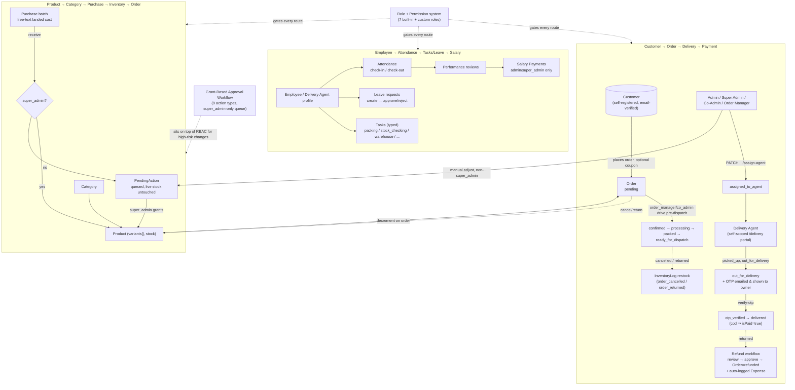

# Saudi Authentic Product — Project Roadmap

_Fresh audit, 2026-08-26. Everything below was independently verified against the running code — not copied from `CLAUDE.md`/`README.md` without checking — but those two files already contain an extremely accurate, current self-audit (see "How this audit was done")._

## How this audit was done

This is not a codebase that needed archaeology — `CLAUDE.md` (2154 lines) and `README.md` are both detailed, current, and cross-consistent. Rather than restate them uncritically, I independently verified the claims that matter most:

| Check | Result |
|---|---|
| `server`: `npm run typecheck` | ✅ clean |
| `server`: `npm run lint` | ✅ clean |
| `server`: `npm test` (Jest — 10 unit specs + 16 real Mongo-backed integration specs) | ✅ **27 suites / 198 tests pass** |
| `client`: `npm run typecheck` | ✅ clean |
| `client`: `npm run lint` | 1 pre-existing warning (`proxy.ts`, unused param), 0 errors |
| `client`: `npm test` (Vitest + RTL) | ✅ **8 files / 42 tests pass** |
| `client`: `npm run build` | ✅ 53 routes, compiles clean |
| `npm audit --omit=dev` (both apps) | ✅ **0 vulnerabilities** |
| `grep -r "TODO\|FIXME\|XXX\|HACK:"` over both `src/` trees | 0 real hits (only false positives — a phone-number placeholder string) |
| `git status` | clean, nothing uncommitted; last commit 2026-08-24, matching the docs' own claimed freshness |

Conclusion: this is a mature, well-tested, honestly-documented codebase. The useful audit here isn't "here's what's secretly broken" — it's confirming that's true, organizing the picture clearly, and being precise about the handful of things that are genuinely incomplete (which the project's own docs already name correctly).

## 1. Current completed features

An e-commerce platform (Saudi dates/gift boxes, BDT currency, Bangladesh-district shipping) with a customer storefront plus five internal portals (Admin / Co-Admin / Order Manager / Employee / Delivery Agent), all sharing one Express 5 + Mongoose API and one Next.js 16 client.

**Storefront**: full catalog (categories, products with variants, image gallery + zoom/lightbox), cart & wishlist (client-side, `localStorage`), coupons (live discount preview), checkout, order placement, public order tracking by order number + email, reviews, homepage (admin-managed hero carousel + 9 section types), About/Contact/Shipping-Policy (admin-editable body copy), account dashboard (orders/wishlist/addresses/profile), dark mode (site-wide, token-driven).

**Auth & identity**: email/password with strength rules, email verification gating order/review actions, Google Sign-In (built, inactive pending a `GOOGLE_CLIENT_ID`), forgot/reset password (one flow for all 7 roles), account lockout after 5 failed attempts, TOTP 2FA with recovery codes, idle-session timeout for staff, Super-Admin impersonation (bearer-token, audit-logged, no cookie tampering), silent access-token refresh on the client.

**RBAC**: role **+ permission** based — 7 built-in roles (`customer/employee/delivery_agent/co_admin/order_manager/admin/super_admin`) seeded as editable `Role` documents, plus freely-creatable custom roles. Escalation guards (can't grant what you don't hold, can't re-permission `SUPER_ADMIN`, can't delete an assigned role) live in the service layer, not just the route.

**Orders & delivery**: 14-status pipeline with an explicit transition table (invalid moves 400 regardless of role), delivery-agent self-scoped endpoints, OTP-verified delivery confirmation (emailed + shown to the order owner, since there's no SMS gateway), automatic restock on cancel/return, full per-change status-history audit trail (actor/role/previous-status).

**Employees**: attendance (self check-in/out), leave requests (create/approve/reject), tasks (typed, filterable), performance reviews, salary payments (admin/super-admin only — co_admin deliberately excluded), a read-only live-stock view for warehouse-type tasks.

**Inventory & stock governance**: `Product.variants[].stock` is the single source of truth (no denormalized copies anywhere, `cache: "no-store"` everywhere it's read). **Stock-change approval gate**: only `super_admin` changes stock directly — every other role's change (via product edit or manual adjustment) is queued as a `PendingAction` and applies only on a Super Admin grant, re-evaluated against current stock at grant time. Overlapping queued requests on the same variant are flagged to the reviewer.

**Purchasing**: per-shop purchase batches with an open-ended (free-text, no fixed enum) landed-cost breakdown; totals/unit-cost are derived on every read, never stored; receiving a batch moves stock through the same approval gate; a received batch's costs are immutable (correction = a new batch).

**Finance**: append-only investment ledger, categorized expenses (co_admin submissions need admin confirmation, threshold-gated to require a Super-Admin grant above a configurable amount), a refund workflow (request → review → approve, with its own approval-gating for co_admin requests and above-threshold admin approvals) that auto-logs a confirmed expense and flips the order to `refunded`, and a derived (never stored) revenue/expense/profit-loss summary.

**Content management** (all fixed-surface, explicitly not a general CMS): homepage hero slides + 9 section types, header nav links, footer columns, site settings (logo/announcement/contact/social), and About/Contact/Shipping-Policy body copy — all admin-editable with no code change, none of it arbitrary page/route creation.

**Cross-cutting**: append-only `AuditLog` for sensitive actions outside the stock/order/approval systems' own trails (role/status changes, settings edits, product content edits — diffed so a no-op save writes nothing), a Grant-Based Approval Workflow (`PendingAction`/`ApprovalSettings`) reused across 9 distinct gated action types rather than one-off per feature, operational email fan-out for new-order/low-stock/delivery-failure to the staff roles that own each workflow.

## 2. Partially completed features

These are documented in both `CLAUDE.md`'s "Known limitations" and `README.md`'s — I independently confirmed each is real (not stale) by checking the relevant code, not just trusting the prose:

| Area | What works | What's incomplete |
|---|---|---|
| Payment | `paymentMethod` (`cod`/`bkash`/`nagad`) is captured and stored | **No actual gateway integration exists** — no `config/payment.ts`, no webhook route, no signature verification. `Order.isPaid` only ever flips for a `cod` order reaching `delivered`. A customer selecting bKash/Nagad today is never actually charged by this codebase. |
| Approval-gate coverage | 9 specific action types (coupon, product deletion, stock changes ×2, refund ×2, expense confirm, purchase receive) are fully gated | Role changes, settings edits, and other sensitive-but-not-listed actions are audit-*logged* only, never routed through grant/deny. |
| 2FA | Full TOTP + recovery-code flow works | Opt-in only — cannot be enforced org-wide for staff, and there's no admin-side reset if someone loses both their authenticator and all 8 recovery codes (recovery is a manual DB edit today). |
| Custom roles | Freely creatable, additive permission bundles | Can only **add** to a built-in role's permissions, never subtract — there's no per-user deny list, so "give this one Employee fewer rights than Employee normally has" isn't expressible without re-permissioning the whole Employee role. |
| Shop scoping | Server-side, fails closed, applied to every Purchase/Shop read+write | Additive only — no "every shop except one," and it's per-user, not per-role. |
| Stock-conflict handling | Concurrent queued requests on one variant are flagged to the reviewer with a "Conflicts with N" badge | Nothing actually blocks or auto-resolves the conflict — both still apply in grant order; resolving it stays a human judgment call. |
| Notifications | 3 specific operational events (new order, low stock, delivery failure) fan out to the right staff roles by email | No per-user preferences, no in-app inbox, no digest/batching — a busy day is one email per event per relevant staff member. |
| Session security | Idle-timeout for staff, all-sessions logout via `tokenVersion` | Both are **per-user**, not per-device — there's no session list and no single-device revocation. |
| Purchases/Investments | Full landed-cost accounting, immutable once received/recorded | No edit/reversal path by design (append a correcting batch/entry instead) — this is intentional, not a gap, but worth knowing before someone goes looking for an edit button. |
| Google Sign-In | Wired end-to-end, both `.env` keys documented | Inactive on this machine — no `GOOGLE_CLIENT_ID` provisioned yet. Purely a config step, not missing code. |
| Test coverage | 198 backend + 42 frontend tests, all passing, covering the highest-risk flows (auth, RBAC, approval gates, stock, finance, security) | Not exhaustive — most individual pages/components have no dedicated test, and there is no Playwright/e2e browser suite. |

## 3. Missing features (genuinely absent, not just partial)

- **Real payment gateway** (bKash/Nagad/SSLCommerz or similar) — see above. This is almost certainly the single highest-value gap for a live storefront: right now every non-COD order is effectively "pay on trust."
- **SMS gateway** — no phone-OTP signup/login, no SMS delivery notifications anywhere. The delivery-OTP flow already works around this by emailing the code and displaying it on the order-tracking page, so it's a real, working substitute — but see the discrepancy below.
- **General page builder / arbitrary routes** — every admin-editable surface (homepage, nav, footer, 3 static pages) is a fixed, named type. There's no way to spin up a new page or content block without a code change.
- **Cross-device cart/wishlist** — both are `localStorage`-only by design; there's no server-side cart model at all.
- **`frontend/src/middleware.ts`** — route protection is entirely client-side (`RoleGuard`) plus real backend `authorize()`/`requirePermission()`; there's no server-side redirect before an unauthorized page ships to the browser (cosmetic-only gap — the API is the real boundary and is unaffected).

### One discrepancy worth fixing
`server/src/models/StaticPage.model.ts`'s seeded Shipping Policy copy tells customers: *"you will receive a confirmation with tracking details via SMS and email."* There is no SMS capability anywhere in this codebase (confirmed by grep — the only other "SMS" hit in the entire source tree is this same string). An admin can edit this at `/admin/pages`, but the **default seeded text over-promises a channel that doesn't exist** — worth correcting the copy or wiring an actual SMS provider before this is live for real customers.

## 4. Recommended next steps

1. **Fix the Shipping Policy SMS copy** (above) — a 2-minute content edit at `/admin/pages`, zero code risk, prevents a real customer-facing broken promise.
2. **Payment gateway integration** if this is going toward a real launch — bKash and SSLCommerz both have Bangladesh-focused SDKs; the codebase already has the right seam (`Order.paymentMethod`, `Order.isPaid`, the existing webhook-free `config/` pattern for other optional integrations like Cloudinary/SMTP/Google) to slot one in without restructuring anything.
3. **Provision a `GOOGLE_CLIENT_ID`** if Google Sign-In should actually be live — the code path is complete and tested, this is purely a config step (both `.env` files, see `backend/.env.example`).
4. **Decide whether 2FA should be enforceable for staff** — if this is meant for a real operations team handling money (salary, refunds, approvals), an org-wide "staff must have 2FA" policy is a small, high-value addition on top of the existing opt-in flow.
5. **Widen test coverage opportunistically** — not a rewrite, just adding a spec whenever a new page/route is touched. The existing suite already proves the pattern works (real Mongo via `mongodb-memory-server`, no mocking of the DB or HTTP layer on the backend).
6. Everything else in §2/§3 is a **deliberate, documented design decision**, not an oversight — re-litigate only if the actual business requirement has changed since it was made (e.g., "we now need per-device session revocation" or "we now need SMS").

## 5. System flow

